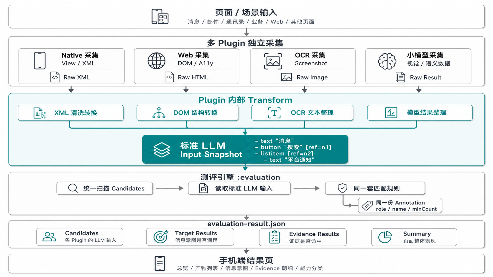

# UI Perception

UI Perception 是一个 Android 端 UI 感知研究项目，目标是对比不同 UI 抓取方向的效果，并把手机屏幕上的 UI 信息转换成适合大模型理解的数据表示。

本项目只关注 UI 感知数据的准备、采集、转换、融合和评测，不包含 Agent 决策、规划或执行操作。

## 项目边界

本项目关注：

- 基准页面与基准意图准备
- 当前页面内容采集
- 不同抓取方向的效果对比
- 多来源 UI 数据转换、清洗与格式整理
- 面向大模型的数据表达
- 感知结果与基准意图的评测

本项目不关注：

- Agent 操作执行
- 自动点击、滑动、输入
- 任务规划与工具调用
- 多轮交互决策

## 模块结构

当前工程按“编排核心 + 技术方向插件 + 基准页面”组织。

```text
:app
├── depends on :baseline-pages
├── depends on :perception-core
├── depends on :evaluation
└── depends on :native-plugin

:evaluation
└── depends on :perception-core

:native-plugin
└── depends on :perception-core

:web-plugin
└── depends on :perception-core

:ocr-plugin
└── depends on :perception-core

:small-model-plugin
└── depends on :perception-core

:baseline-pages
└── no project-module dependency

:perception-core
└── no project-module dependency
```

模块职责：

- `:app`：应用入口、基准页面列表、浮动感知按钮、当前插件装配点。
- `:baseline-pages`：基准页面、页面路由、基准意图资产。
- `:perception-core`：感知编排核心，定义统一插件接口、请求/结果模型和 `PerceptionComposer`。
- `:evaluation`：端上评测模块，读取各插件提供的 LLM 输入、执行标注匹配，并生成 `evaluation-result.json`。
- `:native-plugin`：Native 技术方向工具集，已实现 native 页面抓取与 native XML 转换。
- `:web-plugin`：Web 技术方向占位模块，尚未实现插件类。
- `:ocr-plugin`：OCR 技术方向占位模块，尚未实现插件类。
- `:small-model-plugin`：小模型视觉理解方向占位模块，尚未实现插件类。

## 当前链路

当前 `:app` 已打通 native 方向的采集、转换、评测和手机端结果展示。Web、OCR、小模型模块已预留，后续只要按统一 LLM 输入契约输出 transformed 产物，即可被评测模块纳入同一套标注和规则下比较。



```text
基准页面
  ↓
浮动感知按钮
  ↓
PerceptionPlan
  └── plugins = [NativePerceptionPlugin]
  ↓
PerceptionComposer
  ↓
NativePerceptionPlugin.capture()
  ↓
raw native XML
  ↓
NativePerceptionPlugin.transform()
  ↓
standard LLM input snapshot
  ↓
captures/{baselineId}/runs/{runId}/native/raw
captures/{baselineId}/runs/{runId}/native/transformed
  ↓
OnDeviceEvaluationRunner
  ↓
captures/{baselineId}/runs/{runId}/evaluation/evaluation-result.json
  ↓
EvaluationResultActivity
```

已验证的 native 产物示例：

```text
captures/native_home_mail/runs/{runId}/native/raw/native_xml_{timestamp}.xml
captures/native_home_mail/runs/{runId}/native/transformed/native_semantic_snapshot_{timestamp}.yml
captures/native_home_mail/runs/{runId}/evaluation/evaluation-result.json
```

## 核心接口

技术方向插件统一实现 `PerceptionPlugin`。

```java
public interface PerceptionPlugin {
    String name();

    CaptureResult capture(Activity activity, CaptureRequest request);

    TransformResult transform(TransformRequest request);
}
```

约定：

- 一个插件代表一个技术方向，例如 `native`、`web`、`ocr`、`small_model`。
- 插件本身不保存页面状态，作为无状态工具集使用。
- `capture()` 负责产出本技术方向的原始数据。
- `transform()` 负责将该技术方向的原始数据处理成适合后续模型消费的表示，可包含裁剪、清洗、结构压缩或格式转换。
- 暂不支持的阶段直接返回 `null`，由 `PerceptionComposer` 转成错误结果。
- 具体实现可以拆成包内 helper，但对外只暴露一个插件类。

当前 native 插件形态：

```text
native-plugin
├── NativePerceptionPlugin
│   ├── capture() -> NativeViewCaptureTool
│   └── transform() -> NativeXmlTransformTool
├── ViewHierarchyDumper
└── XmlTrimmer
```

## Composer

`PerceptionComposer` 是多抓取方向对比的编排层。一个 `PerceptionPlan` 可以包含多个 `PerceptionPlugin`，composer 会在同一个 baseline 页面上依次执行每个插件。

```text
PerceptionPlan
├── baselineId
├── runId
├── transformEnabled
└── plugins
    ├── NativePerceptionPlugin
    ├── WebPerceptionPlugin
    ├── OcrPerceptionPlugin
    └── SmallModelPerceptionPlugin
```

执行方式：

```text
plugin A: capture -> optional transform
plugin B: capture -> optional transform
plugin C: capture -> optional transform
```

输出结构：

```text
PerceptionRunResult
├── baselineId
├── runId
├── startedAtMs
├── finishedAtMs
└── entries
    ├── PerceptionEntryResult(native)
    ├── PerceptionEntryResult(web)
    ├── PerceptionEntryResult(ocr)
    └── PerceptionEntryResult(small_model)
```

当前实现是顺序执行，不做并发、不做融合。评测由 `:evaluation` 模块在本次 run 产物落盘后执行。

## 数据产物

当前抓取产物写入 app 外部文件目录，并按一次 run 分组：

```text
captures/{baselineId}/runs/{runId}/{pluginName}/raw/{source}_{timestamp}.{ext}
captures/{baselineId}/runs/{runId}/{pluginName}/transformed/{source}_{timestamp}.{ext}
```

这样同一次页面抓取中，native、web、ocr、小模型的结果可以放在同一个 `runId` 下，方便后续对比。

当前 native 链路输出：

- raw：完整原生 View 层级 XML。
- transformed：标准 LLM 输入快照，当前沿用 native semantic snapshot 文本结构。

标准格式见 [LLM Input Snapshot v1](docs/llm-input-snapshot-standard.md)。

参与测评的 transformed 产物约定：

```text
{pluginName}/transformed/llm_input_{timestamp}.yml
```

当前 native 旧文件名仍兼容：

```text
native/transformed/native_semantic_snapshot_{timestamp}.yml
```

评测结果中会统一识别为：

```json
{
  "id": "native.llm_input",
  "plugin": "native",
  "stage": "transformed",
  "type": "llm_input"
}
```

## 添加 Web 能力

`web-plugin` 模块已经存在，只需要补实现，不需要再创建模块。

建议文件形态：

```text
web-plugin
├── WebPerceptionPlugin
├── WebDomCaptureTool
└── WebDomTransformTool
```

实现 `WebPerceptionPlugin`：

```java
public final class WebPerceptionPlugin implements PerceptionPlugin {
    @Override
    public String name() {
        return "web";
    }

    @Override
    public CaptureResult capture(Activity activity, CaptureRequest request) {
        // 从 WebView 或页面上下文获取 DOM 原始数据。
        // 暂未实现时返回 null。
        return null;
    }

    @Override
    public TransformResult transform(TransformRequest request) {
        // 对 DOM 做裁剪、去噪、结构压缩或格式转换。
        // 暂未实现时返回 null。
        return null;
    }
}
```

接入步骤：

- 在 `:app` 中装配 `WebPerceptionPlugin`。
- 把它加入 `PerceptionPlan` 的插件列表。
- 补充真实 Web 基准页。当前 `:baseline-pages` 只有 Web 占位入口，真实 Web DOM 验收前需要提供可稳定复现的 WebView 页面和基准意图资产。

## 添加 OCR 能力

`ocr-plugin` 模块已经存在，只需要补实现，不需要再创建模块。

建议文件形态：

```text
ocr-plugin
├── OcrPerceptionPlugin
├── ScreenshotCaptureTool
├── OcrEngineAdapter
└── OcrTransformTool
```

实现 `OcrPerceptionPlugin`：

```java
public final class OcrPerceptionPlugin implements PerceptionPlugin {
    @Override
    public String name() {
        return "ocr";
    }

    @Override
    public CaptureResult capture(Activity activity, CaptureRequest request) {
        // 获取截图并执行 OCR，输出原始 OCR 结果。
        // 暂未实现时返回 null。
        return null;
    }

    @Override
    public TransformResult transform(TransformRequest request) {
        // 合并文本块、过滤噪声、规范化坐标和置信度。
        // 暂未实现时返回 null。
        return null;
    }
}
```

OCR 输出建议：

- raw 输出保留 OCR 引擎原始信息。
- transformed 输出标准 LLM 输入快照，即 `{pluginName}/transformed/llm_input_{timestamp}.yml`。

## 添加小模型能力

`small-model-plugin` 模块已经存在，只需要补实现，不需要再创建模块。

建议文件形态：

```text
small-model-plugin
├── SmallModelPerceptionPlugin
├── SmallModelCaptureTool
└── SmallModelTransformTool
```

建议插件名：

```java
public final class SmallModelPerceptionPlugin implements PerceptionPlugin
```

职责建议：

- `capture()`：输入截图或页面上下文，产出小模型原始理解结果。
- `transform()`：压缩小模型输出，保留对象、文本、区域、层级或动作相关语义。

## 开发原则

- 新技术方向优先实现一个 `PerceptionPlugin`，不要先改 composer。
- 插件对外保持单一入口，内部可以拆无状态 helper。
- capture 输出原始信息，transform 输出适合模型消费的转换结果。
- 不要在 capture 内部私自做 transform。
- 不要在插件内部做跨技术方向融合；融合应由后续 composer 或独立编排层负责。
- 每个新增能力都应提供可验证的基准页面、输入、输出和验收方式。

## 当前状态

已完成：

- Native 基准页面：消息、邮件、通讯录、业务。
- Native 原始 XML 抓取。
- Native XML 转换为标准 LLM 输入快照。
- `:perception-core` 多插件 plan / run / entry 结果结构。
- 通过浮动按钮触发 native capture -> transform 链路。
- `:evaluation` 端上评测模块。
- 手机端 `evaluation-result.json` 生成。
- 手机端评测结果页。
- 统一 LLM 输入候选产物识别，支持 `{plugin}/transformed/llm_input_*.yml`。
- `:web-plugin`、`:ocr-plugin`、`:small-model-plugin` 模块占位。

未完成：

- 真实 Web 基准页与 Web DOM 抓取。
- OCR 截图、识别与转换能力。
- 小模型视觉理解能力。
- 不同插件的单独覆盖率统计展示。
- 多源融合。

## 相关文档

- [LLM Input Snapshot v1 标准](docs/llm-input-snapshot-standard.md)
- [Native XML 处理路线](docs/android-native-xml-transform-route.md)
- [其他采集方式评测接入说明](docs/plugin-evaluation-integration.md)
